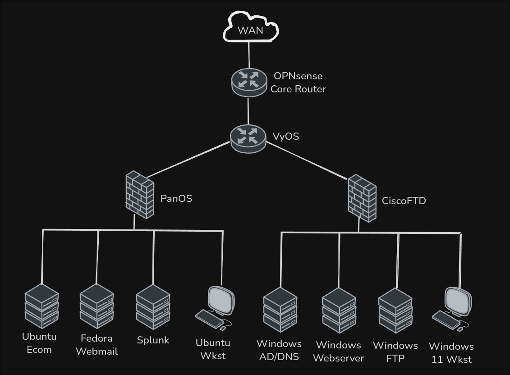

<div align="center">

<p>
  
</p>

<p align="center">
  <a href="https://developer.hashicorp.com/terraform">
    
  </a>
  <a href="https://docs.ansible.com/">
    
  </a>
  <a href="https://microsoft.com/powershell">
    
  </a>
</p>

# CCDC at EKU's Lab Automation
</div>

## Disclaimer

This repository is in an extremely early and broken state currently, though will soon be ready for use.

This repository contains configurations specific to how our Proxmox VE 8.4.0 environment is set up, and is developed for the sole purposes of cloning and tearing down *our* working environment for practice competitions. This will not work on other systems without following the specific steps to replicate our templates. It is open-source as a potential reference for other teams or colleagues down the line.

## Repo Layout

```text
ccdc-lab-tf/
├─ conf/                     # Generalizing VMs
│  ├─ Cloudbase-Init/        # Cloudbase-Init for Windows guests
│  │  ├─ conf/               # Configuration files
│  │  ├─ LocalScripts/       # Scripts to run on cloud-init
│  │  └─ README.md
│  └─ Cloud-Init/            # Cloud-Init for Linux-based guests
│  │  └─ README.md
├─ infra/                    # Duplicating VMs
│  ├─ ansible/               # Ansible for guest software configuration
│  │  ├─ inventories/        # Individual inventory per environment
│  │  │  ├─ lab01/
│  │  │  └─ etc...
│  │  ├─ playbooks/          # Playbooks for each service
│  │  ├─ roles/              # Roles for each server
│  │  └─ README.md
│  └─ tf/                    # Terraform for guest hardware configuration
│     ├─ clones.auto.tfvars  # Auto-loaded variable values
│     ├─ main.tf             # Primary Terraform definitions
│     ├─ provider.tf         # Provider configuration
│     ├─ variables.tf        # Input variables
│     ├─ versions.tf         # Terraform/provider version artifacts
│     └─ README.md
├─ scripts/
│  ├─ Invoke-TfClones.ps1    # Helper: generate inputs + clone envs
│  ├─ Invoke-TfTeardown.ps1  # Helper: tear down envs
│  └─ README.md
├─ .gitignore
├─ LICENSE
└─ README.md
```

## The Flow

This repository contains five key elements that make up our environment for proper automation:

- Our configurations for Cloudbase-Init for Windows guests
- Our configurations for cloud-init for Linux-based guests
- Our description of the environment via Terraform
- Our description of the environemnt via Ansible
- Helper scripts written in PowerShell that completely automate the workflow

## Read More

Each individual folder has its own README.md that goes into more depth on the specific processes used.