# Cloudbase-Init Template Prep for Windows Server on Proxmox

This directory contains the files used to prepare a Windows Server VM to be converted into a reusable Proxmox template.

Terraform is expected to handle the Proxmox clone side later. This README only covers preparing the source VM up to the point where it is ready to become a template.

## Files

```text
Cloudbase-Init/
├── conf/
│   ├── cloudbase-init.conf
│   ├── cloudbase-init-unattend.conf
│   └── Unattend.xml
├── LocalScripts/
│   └── 01-winrm-network.ps1
└── README.md
```

## Version

Currently this specific method has been tested on Windows Server 2019 and 2022 on Proxmox VE 8.4.0 with Cloudbase-Init 1.1.6.
You must have either root or Administrative access over Proxmox, and shell access to either root or a PAM-authenticated account with sudo permissions.

## Prep Steps

### 1. Build the base VM

Follow the normal procedure to install Windows Server as a Proxmox guest VM.

Then install:

- Windows updates
- VirtIO drivers
- any other software you want baked into the template

Please keep it minimal, especially refraining from installing Windows features at this time, as Ansible is better equipped to configure these after cloning, and some features (like AD DS) are not compatible with sysprep.

### 2. Install Cloudbase-Init

Install [Cloudbase-Init](https://cloudbase.it/cloudbase-init/) inside the VM.

When this configuration page is reached, ensure that the Username reflects that of the local Administrator account, and that Run Cloudbase-Init server as LocalSystem is checked:

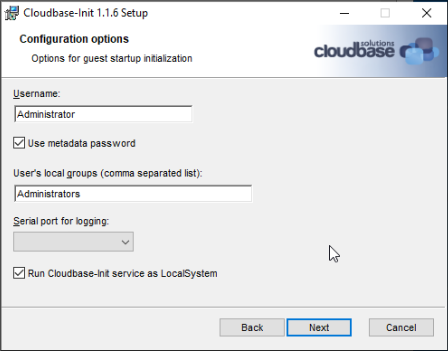

Ensure you do NOT click either checkbox at the end of the installation process when it asks about sysprep, as you will be running sysprep manually at the end of this process:

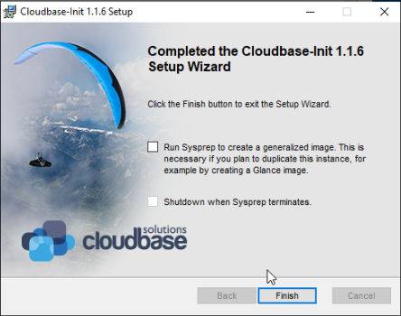

After finishing, copy the files from this repository into the Cloudbase-Init install directory, overwriting if necessary:

```text
C:\Program Files\Cloudbase Solutions\Cloudbase-Init\conf\cloudbase-init.conf
C:\Program Files\Cloudbase Solutions\Cloudbase-Init\conf\cloudbase-init-unattend.conf
C:\Program Files\Cloudbase Solutions\Cloudbase-Init\LocalScripts\01-winrm-network.ps1
```

If C:\Program Files\Cloudbase Solutions\Cloudbase-Init\conf\Unattend.xml is already present, verify that it is correctly configured and points to:

```
C:\Program Files\Cloudbase Solutions\Cloudbase-Init\conf\cloudbase-init-unattend.conf
```

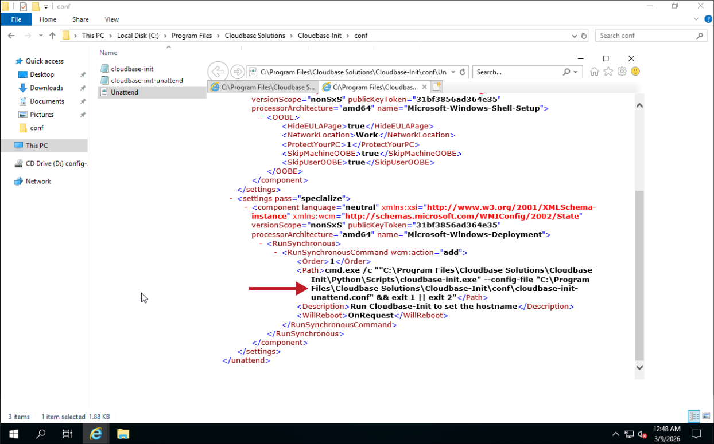

If Unattend.xml is missing or improperly configured, replace it with the Unattend.xml from this repository.

Ensure that the Cloudbase-Init service to run as LocalSystem in an elevated Command Prompt or PowerShell:

```powershell
sc.exe qc cloudbase-init
```

Expected:

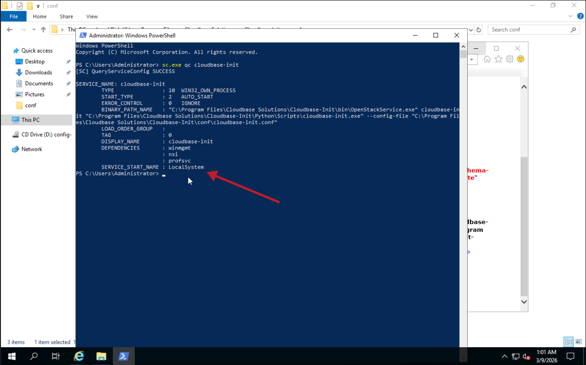

If this shows a local cloudbase-init account instead of LocalSystem, run:

```powershell
sc.exe config cloudbase-init obj= LocalSystem
```

### 3. Prepare the template NIC

It is worth noting that connection to the internet is not necessary for the remainder of this process, so do not be alarmed.

Ensure that there is no preconfigured static IP on the machine. This can be done by running `ncpa.cpl` in an elevated Command Prompt or PowerShell, double clicking the adapter, clicking Properties, double clicking IPv4 Settings, and ensuring "Obtain an IP address automatically" and "Obtain DNS server address automatically" are selected.

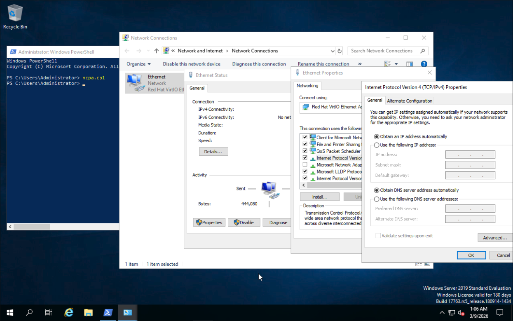

If you wish, for extra security, run the following in an elevated Command Prompt or PowerShell to ensure no addresses persist:

```powershell
ipconfig /release
```

### 4. Generalize and shut down the VM

Run this specific sysprep from an elevated Command Prompt or PowerShell, ensuring it points to your properly configured Unattend.xml file:

```text
C:\Windows\System32\Sysprep\Sysprep.exe /generalize /oobe /shutdown /unattend:"C:\Program Files\Cloudbase Solutions\Cloudbase-Init\conf\Unattend.xml"
```

If this error prevents you from running sysprep (common in Windows 2022+ where Edge is installed):

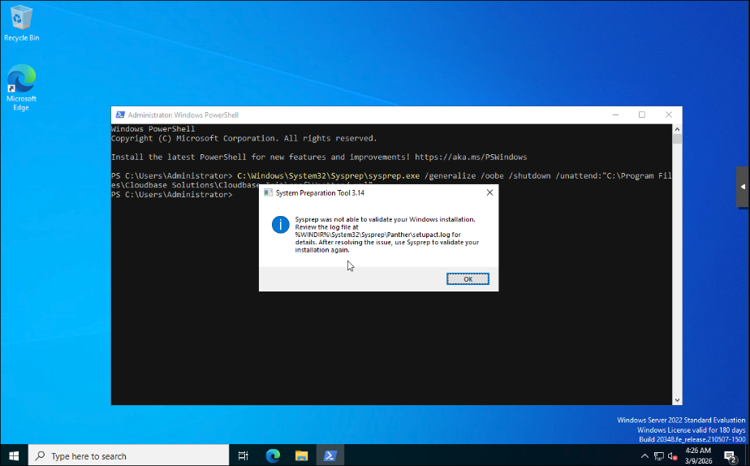

It is very likely because there is an App / Appx Package mismatch where a program was installed for one user but not all. Microsoft’s Sysprep guidance says this blocks /generalize, and their remediation is to remove the package from the user and from the provisioned app list using `Remove-AppxPackage -AllUsers` and `Remove-AppxProvisionedPackage -Online`.

Here is an example to find out if Edge is the culprit (run in elevated PowerShell):

```powershell
Get-AppxPackage -AllUsers Microsoft.MicrosoftEdge.Stable | Select Name, PackageFullName
Get-AppxProvisionedPackage -Online | Where-Object DisplayName -like "*MicrosoftEdge.Stable*" | Select DisplayName, PackageName
```

And how to clear it out:

```powershell
Get-AppxPackage -AllUsers Microsoft.MicrosoftEdge.Stable | Remove-AppxPackage -AllUsers
Get-AppxProvisionedPackage -Online |
  Where-Object DisplayName -like "*MicrosoftEdge.Stable*" |
  ForEach-Object { Remove-AppxProvisionedPackage -Online -PackageName $_.PackageName }
```

### 5. Proxmox Web UI Configuration

Once shutdown, please disconnect both the installation iso cdrom and virtio-win driver cdrom from the VM you are about to template.

Within the Proxmox Web UI, navigate to the Hardware tab, click the Add dropdown, and attach a CloudInit Drive:

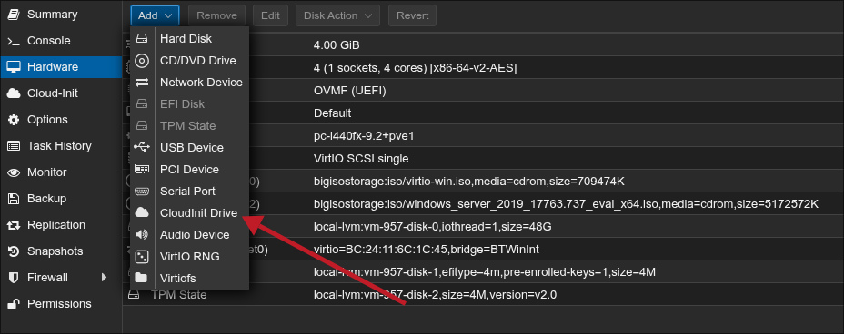

Ensure it is ide2, and select your lvm storage:

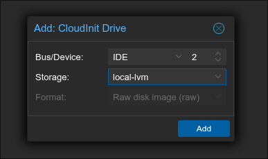


If you had installed VirtIO drivers and the QEMU Agent on your Windows Server install, please enable QEMU Agent within the Options tab:

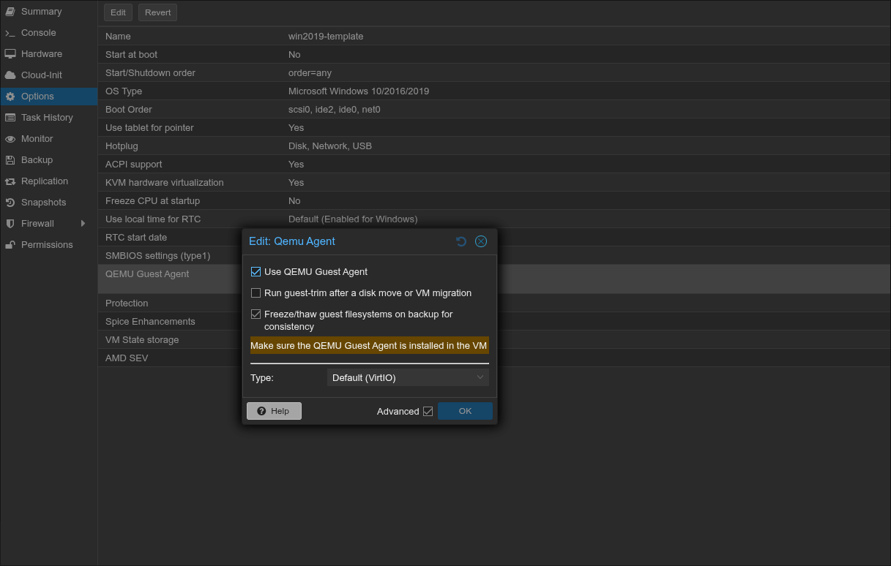


### 6. Proxmox CLI Configuration

Navigate to the Proxmox node you are currently setting up the VM on, and gain a privileged shell to it.

Run the following commands, replacing VM-ID with the ID number of the VM that you were just configuring:

```bash
qm set <VM-ID> --citype configdrive2
qm set <VM-ID> --boot "order=scsi0;ide2;net0"
qm cloudinit update <VM-ID>
```

Expected:

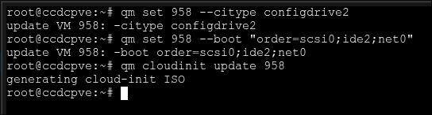

Verify now with:

```bash
qm config <VM-ID>
```

Example expected config should include the following lines:

```text
ostype: <windows version>
citype: configdrive2
ide2: local-lvm:vm-<VMID>-cloudinit,media=cdrom
boot: order=scsi0;ide2;net0
```

### 6. Convert the VM to a template

After sysprep shuts the VM down, convert it to a Proxmox template.

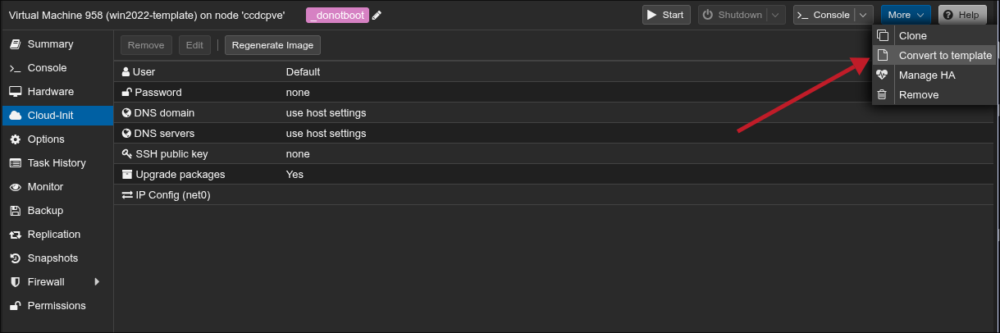

Stop here. The template is now ready for Terraform to clone and configure through Proxmox Cloud-Init metadata.